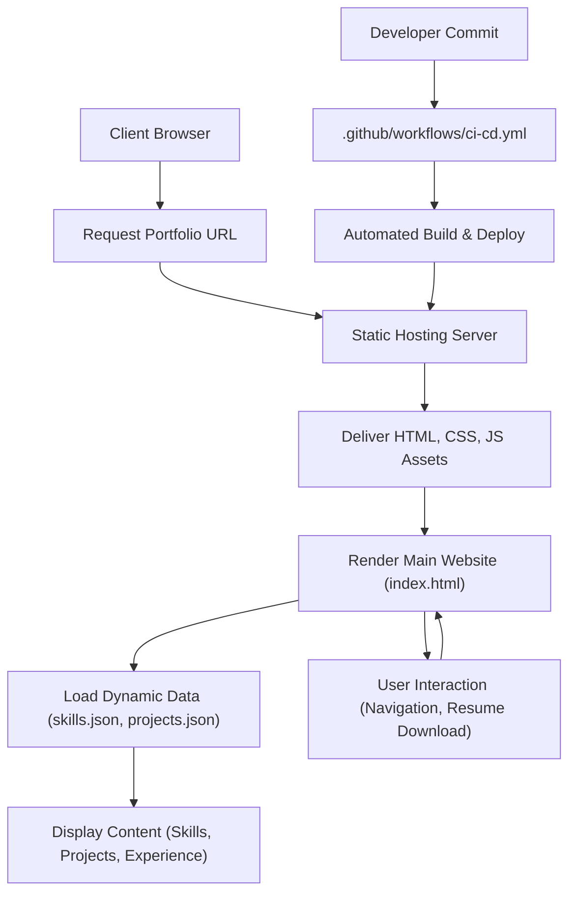

# 🚀 Dynamic Portfolio Website

<p align="center"></p>

## Short Description
Showcasing a principal software developer's prowess in technical marketing, this repository unveils a sleek, responsive, and feature-rich personal portfolio website. Engineered for impactful presentation, it dynamically highlights skills, projects, and professional experience, providing an engaging narrative for potential employers and collaborators. With a focus on modern web practices, including a robust CI/CD pipeline, this portfolio is a testament to cutting-edge front-end development and efficient project deployment.

## ✨ Key Features
*   **Dynamic Content Loading:** Skills and projects are loaded from intuitive JSON files, allowing for easy updates and content management without touching the core HTML.
*   **Responsive Design:** Flawlessly adapts across various devices and screen sizes, ensuring an optimal viewing experience for all visitors.
*   **Dedicated Sections:** Comprehensive pages for professional experience, detailed projects, and a clear breakdown of technical skills.
*   **Interactive UI/UX:** Utilizes modern JavaScript libraries (e.g., `particles.min.js`) for engaging visual effects and a smooth user experience.
*   **Custom 404 Page:** A branded and user-friendly custom 404 error page to enhance navigation and maintain a professional appearance.
*   **Integrated CI/CD:** Automated testing and deployment workflows via GitHub Actions ensure code quality and seamless updates.
*   **Downloadable Resume:** Provides a direct link for visitors to download the developer's resume in PDF format.

## Who is this for?
This portfolio is ideal for:
*   **Potential Employers:** Quickly and effectively present your qualifications, projects, and professional journey.
*   **Recruiters:** Access a comprehensive overview of your technical stack, experience, and contributions.
*   **Collaborators:** Showcase your expertise and project capabilities to potential team members.
*   **Anyone Interested in Modern Web Development:** A clear demonstration of best practices in front-end development and static site deployment.

## Technology Stack & Architecture
This project is built using a robust and widely adopted front-end stack, focusing on performance, maintainability, and user experience.

*   **Frontend:** HTML5, CSS3 (with extensive custom styling), JavaScript (Vanilla JS, `particles.min.js` for effects).
*   **Data Management:** JSON files (`skills.json`, `projects/projects.json`) for dynamic content population.
*   **Version Control:** Git & GitHub.
*   **CI/CD:** GitHub Actions (`.github/workflows/ci-cd.yml`) for automated deployment.
*   **Editor Configuration:** VS Code (`.vscode/settings.json`) for consistent development environment settings.

## 📊 Architecture & Database Schema
This is primarily a static single-page application (SPA) portfolio. There's no complex database, rather content is served from local JSON files. The architecture focuses on client-side rendering and efficient delivery of assets.



## ⚡ Quick Start Guide
To get a copy of this project up and running on your local machine for development and testing purposes, follow these simple steps:

1.  **Clone the repository:**
    ```bash
    git clone https://github.com/sravanik-25/portfolio_website.git
    cd portfolio_website
    ```
2.  **Open in your browser:**
    Simply open the `index.html` file in your preferred web browser. All content is served statically, so no local server is required for basic viewing.
    ```bash
    # Example using a file path
    open index.html
    ```
    Alternatively, use a live server extension in VS Code for hot reloading during development.

## 📜 License
This project is licensed under the MIT License. See the `LICENSE` file for full details.