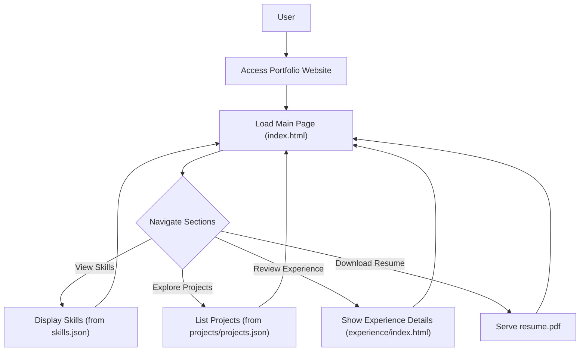

# 🚀 Dynamic Portfolio Website

<p align="center"></p>

## Short Description
Presenting a meticulously crafted, fully responsive, and visually stunning personal portfolio website designed to showcase your skills, experience, and projects with unparalleled elegance and technical sophistication. This repository hosts a powerful static site, engineered for high performance and seamless user experience, making your professional narrative unforgettable.

## ✨ Key Features
*   **Immersive User Interface:** A modern, clean, and highly responsive design ensuring a beautiful experience across all devices.
*   **Comprehensive Skill Showcase:** Dynamically loads and presents your diverse technical and soft skills, giving visitors a clear overview of your capabilities (powered by `skills.json`).
*   **Detailed Project Portfolio:** Highlights your innovative projects with dedicated sections, enriched by dynamic content pulled from `projects/projects.json`.
*   **Professional Experience Timeline:** A dedicated section to articulate your career journey and professional accomplishments.
*   **Downloadable Resume:** Provides direct access to your professional resume (`assests/resume.pdf`) for easy download by recruiters and potential collaborators.
*   **Interactive Animations:** Utilizes `particles.min.js` and custom JavaScript for engaging visual effects and smooth transitions.
*   **Robust CI/CD Pipeline:** Integrated GitHub Actions (`.github/workflows/ci-cd.yml`) for automated testing and deployment, ensuring continuous delivery and stability.
*   **Custom 404 Page:** A branded and user-friendly error page to guide visitors back on track.

## Who is this for?
This project is ideal for:
*   **Software Developers & Engineers:** Looking to create a compelling online presence to attract job opportunities.
*   **Designers & Creatives:** Seeking a platform to display their visual work and professional journey.
*   **Students & Graduates:** Aspiring to present their academic projects and skills to potential employers.
*   **Anyone** needing a sophisticated and easy-to-manage static website to showcase their professional identity.

## Technology Stack & Architecture
This portfolio is built on a robust, modern web stack, prioritizing performance, maintainability, and scalability for a static site.

*   **Frontend Development:**
    *   **HTML5:** Structured and semantic content markup.
    *   **CSS3:** Styled with custom CSS (`assests/css/style.css`, `assests/css/404.css`) for a unique aesthetic.
    *   **JavaScript:** Enhances interactivity, handles dynamic content loading (from `.json` files), and powers animations (`assests/js/app.js`, `assests/js/script.js`, `assests/js/particles.min.js`).
*   **Version Control & Development:**
    *   **Git:** For source code management.
    *   **VS Code:** Preferred development environment (`.vscode/settings.json`).
*   **Continuous Integration/Continuous Deployment (CI/CD):**
    *   **GitHub Actions:** Automates build, test, and deployment workflows (`.github/workflows/ci-cd.yml`), ensuring that changes are reliably delivered.

## 📊 Architecture & Database Schema
This is a static web application; therefore, a traditional backend database schema is not applicable. The architecture is client-side focused, leveraging JSON files for content management.

Here's a high-level flowchart illustrating the user interaction and data flow:



## ⚡ Quick Start Guide
To get this impressive portfolio website up and running locally or deployed:

1.  **Clone the repository:**
    ```bash
    git clone https://github.com/sravanik-25/portfolio_website.git
    cd portfolio_website
    ```
2.  **Open in your browser:**
    Simply open the `index.html` file in your preferred web browser to view the portfolio locally.
    ```bash
    # Example for macOS/Linux (might vary)
    open index.html
    # For Windows
    start index.html
    ```
3.  **Deployment:**
    This project is a static site and can be effortlessly deployed to platforms like GitHub Pages, Vercel, Netlify, or any static hosting service. The integrated GitHub Actions workflow (ci-cd.yml) can be adapted for automated deployment upon pushes to your main branch.

## 📜 License
This project is licensed under the MIT License. See the [LICENSE](LICENSE) file for details.