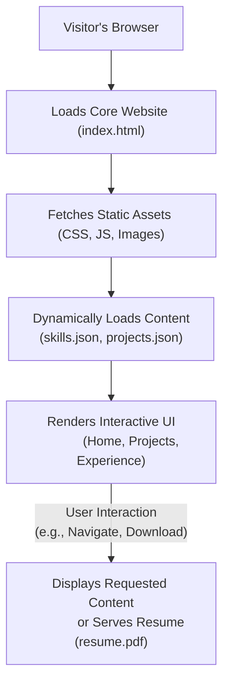

# 🚀 Dynamic Personal Portfolio Website

<p align="center"></p>

## Short Description
Showcase your professional journey, innovative projects, and valuable skills with this sleek, responsive, and dynamic personal portfolio website. Designed for developers, designers, and creatives, this template provides an engaging platform to impress recruiters, foster collaborations, and highlight your unique capabilities. Featuring automated deployments and a clean, interactive user experience, it's your digital handshake to the world.

## ✨ Key Features
*   **Modern & Responsive Design:** Flawless display across all devices, from desktops to smartphones.
*   **Dynamic Content Loading:** Projects and skills are loaded from local JSON files, making content updates effortless without touching HTML.
*   **Dedicated Sections:** Clearly organized pages for Home, Projects, Experience, and a custom 404 error page.
*   **Interactive User Experience:** Engaging UI elements and subtle animations powered by JavaScript and libraries like `particles.js`.
*   **Integrated Resume Download:** A convenient link for visitors to download your professional resume.
*   **Automated Deployment (CI/CD):** Leverages GitHub Actions for seamless and continuous deployment of updates.
*   **Easy Customization:** Structure allows for quick personalization of content, styles, and imagery.

## Who is this for?
This project is ideal for:
*   **Software Developers & Engineers:** Looking to present their coding projects, technical skills, and professional experience.
*   **Designers & Creatives:** Who want an elegant platform to display their portfolio and creative works.
*   **Students & Job Seekers:** Aiming to stand out to recruiters and potential employers.
*   **Anyone** needing a personal branding website to showcase their professional profile.

## Technology Stack & Architecture
This portfolio website is a testament to robust frontend development practices, built with a focus on performance and maintainability.

*   **Frontend:**
    *   **HTML5:** Structured and semantic content.
    *   **CSS3:** Styling and responsive layouts, including custom CSS (`style.css`, `404.css`).
    *   **JavaScript (Vanilla JS):** Powers interactivity, dynamic content loading, and user experience enhancements (`app.js`, `script.js`, `particles.min.js`).
*   **Content Management:**
    *   **JSON:** Local `skills.json` and `projects/projects.json` files for easy data management and dynamic rendering of portfolio content.
*   **Development Tools:**
    *   **VS Code:** Project setup and configuration (`.vscode/settings.json`).
*   **Continuous Integration/Continuous Deployment (CI/CD):**
    *   **GitHub Actions:** Automated workflow for building and deploying the website (`.github/workflows/ci-cd.yml`).

## 📊 Architecture & Database Schema
This project follows a client-side architecture, serving static assets and dynamically loading content from local JSON files to provide a rich user experience. There is no traditional backend database.



## ⚡ Quick Start Guide
Get your personalized portfolio up and running in no time!

1.  **Clone the repository:**
    ```bash
    git clone https://github.com/sravanik-25/portfolio_website.git
    cd portfolio_website
    ```
2.  **Open in Browser:** Simply open the `index.html` file in your preferred web browser.
    ```bash
    # For Linux/macOS
    open index.html
    # For Windows
    start index.html
    ```
3.  **Customize Content:** Update `skills.json` and `projects/projects.json` with your own data. Modify `index.html`, `experience/index.html`, and `projects/index.html` as needed, and replace images in `assests/images/`.
4.  **Deploy (Optional):** Push your changes to a GitHub repository, and if configured, GitHub Actions will handle the automatic deployment (e.g., to GitHub Pages).

## 📜 License
This project is licensed under the terms found in the `LICENSE` file.